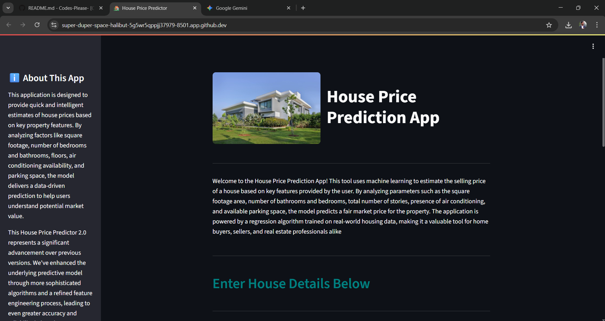

# 🏡 House Price Predictor (v2)

This is an improved version of my earlier House Price Prediction app, now featuring a cleaner interface, more user-friendly controls, and a broader set of input features to generate better predictions.

---

## 🚀 Overview

This web app predicts house prices using a trained **Ridge Regression** model. It's built with **Streamlit** and allows users to input housing characteristics to estimate the property's market value instantly.

---

## ✅ Key Features

- 🧠 Ridge Regression model chosen after testing multiple regression algorithms.
- ✨ New features added: Basement, Guest Room, Preferred Area, Furnishing Level, etc.
- 🎯 Optimized and interactive UI using column-based layout.
- 🧪 Input validation to ensure values remain within valid ranges.
- 🌀 Spinner animation while model predicts.
- 📏 Currency output formatted in Indian Rupees (INR).

---

## 📊 Model Performance

After evaluating several machine learning models, **Ridge Regression** was selected due to its robust performance and generalization capabilities on both training and unseen test data.

### 🔍 Ridge Regression Evaluation:

#### Train Performance
- **Mean Absolute Error (MAE)**: ₹677,028.69  
- **R² Score**: 0.704  

#### Test Performance
- **Mean Absolute Error (MAE)**: ₹987,143.74  
    * *Context:* This indicates that, on average, the model's predictions deviated by approximately **₹9.87 Lakhs** from the actual house prices. Given that the average house price within our dataset was **₹4,766,729.25** (approximately ₹47.67 Lakhs), this MAE translates to an average absolute percentage error of roughly **20.71%**.
- **R² Score**: 0.650  

> ⚠️ **Note**: While the model's performance metrics suggest room for improvement, particularly in reducing the MAE for precise valuations, the dataset's inherent complexities and potential limitations are recognized. Nonetheless, the model performs reliably for general trend analysis and initial estimation use cases.

---

## 🖼️ Screenshot

Here’s a preview of the app interface:

---
## 📊 Dataset Source

This project uses the [Housing Price Prediction dataset from Kaggle](https://www.kaggle.com/datasets/harishkumardatalab/housing-price-prediction).  
The dataset includes house characteristics such as:
- Area
- Bedrooms
- Bathrooms
- Stories
- Amenities like air conditioning, parking, basement, etc.

---

## 📌 Disclaimer

> This is an educational project. The predicted values are **estimated** and **not meant for real-world financial decision-making**. Use the app for learning and experimentation only.

---

## 📁 Project Structure
├── app.py 
├── model/
│ └── model_pipeline.pkl 
├── dataset/
│ └── Housing.csv 
├── images/
│ ├── house.webp 
│ └── screenshot.png 
├── requirements.txt 
└── README.md
